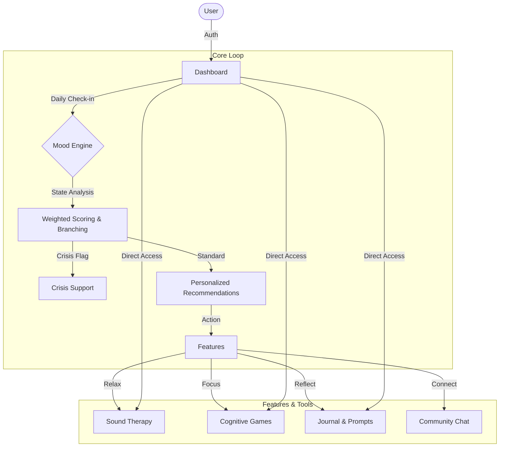

# IamBuddy - Mental Wellness Companion

IamBuddy is a comprehensive mental wellness application designed to help users track their mood, manage stress, and improve cognitive focus through interactive features, personalized therapy recommendations, and gamified exercises.

## 🛠️ Tech Stack

This project is built with a modern, performance-first stack:

### **Frontend Core**
- **React 19**: Latest UI library for building component-based interfaces.
- **TypeScript**: Static typing for robust and maintainable code.
- **Vite**: Next-generation frontend tooling for fast development and building.
- **React Router v7**: Declarative routing for single-page applications.

### **Styling & UI**
- **Tailwind CSS v4**: Utility-first CSS framework for rapid UI development.
- **Radix UI**: Headless, accessible UI primitives for building high-quality components.
- **Lucide React**: Beautiful, consistent, and lightweight icons.
- **Framer Motion**: Production-ready animation library for React.
- **Clsx / Tailwind Merge**: Utilities for dynamic class construction.

### **Backend & Services**
- **Firebase**: Backend-as-a-Service (BaaS) for Authentication and Firestore Database.
- **Agora RTC**: Real-time voice and video communication (Live Therapy).
- **Google Genkit AI**: SDK for future AI-driven adaptive features (configured).

---

## 🔄 Core Workflow

The application follows a central flow centered around the **Dynamic Mood Assessment Engine**, which drives personalized user experiences.



## 🚀 Key Features

- **Dynamic Mood Assessment**: A state-machine-driven assessment engine that adapts questions based on user responses to pinpoint stress, anxiety, or mood levels.
- **Sound Therapy**: Curated library of binaural beats, nature sounds, and chants with a custom audio player.
- **Cognitive Games**:
  - *Bubble Pop* (Stress relief)
  - *Memory Grid* (Focus)
  - *Shape Match* (Cognitive speed)
- **Journaling**: Secure, private mood journaling with prompts.
- **Community**: Anonymous / Safe group chat spaces.

## 📦 Installation & Setup

1. **Install dependencies**
   ```bash
   npm install
   ```

2. **Run Development Server**
   ```bash
   npm run dev
   ```

3. **Build for Production**
   ```bash
   npm run build
   ```
